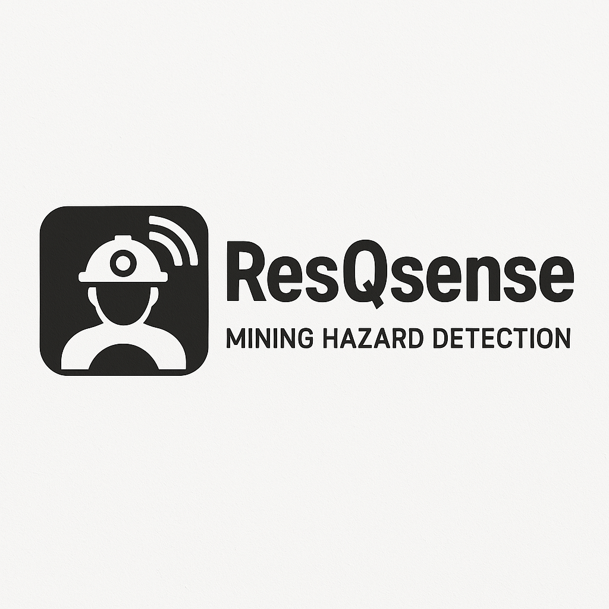

## Overview:
ResQsense is an integrated hazard detection and safety management solution designed for modern mining operations. By combining advanced sensor technologies, robust IoT connectivity, and AI-driven analytics, ResQsense continuously monitors critical environmental and operational parameters in real time. This system enhances safety, operational efficiency, and regulatory compliance by complementing traditional manual inspections with automated data collection and predictive risk assessments.

Engineered for seamless integration into existing mining workflows, ResQsense provides a comprehensive platform for managing hazards, safeguarding personnel, and supporting sustainable mining practices. Its built-in self-fault detection feature automatically identifies potential system issues, eliminating the need for manual testing.

## Current Problems Addressed:
ResQsense is developed to tackle several critical challenges in modern mining operations:

- **Delayed Hazard Detection:** Traditional systems often fail to detect risks such as gas leaks, fires, or structural issues in real time.
- **Lack of Integration:** Existing rescue and safety devices operate in isolation, which reduces overall emergency response efficiency.
- **Unidentified Equipment Failures:** Machines and sensors may fail without warning, leading to unexpected downtimes and safety hazards.
- **Slow Decision-Making:** The absence of edge computing leads to delays in data processing and response actions.
- **Limited Data Insights:** Without a centralized analytics dashboard, organizations struggle to make data-driven safety decisions.
- **Inefficient Monitoring:** There is no unified system to track multiple hazards (pressure, gas, temperature, vibration, flame, sound, current, tilt) in real time.
- **Poor Fault Diagnosis:** Diagnosing the causes of failures in safety equipment is often time-consuming and complex.
- **Data Loss & Accessibility Issues:** Lack of proper data storage and real-time access hampers long-term safety analysis and compliance tracking.

## Key Features:
ResQsense incorporates an array of advanced features that collectively provide a robust and responsive safety management solution:

### Easy Integration with Other Rescue Devices
- **Seamless Connectivity:** Integrates with additional rescue equipment to ensure coordinated safety measures.

### Hazard Detection Module
- **Multi-Sensor Fusion:** Utilizes inputs from various sensors to cross-verify data, thereby enhancing accuracy and reducing false positives.
- **Real-Time Monitoring:** Ensures immediate hazard recognition to facilitate prompt mitigation.

### Self-Fault Detection
- **Automated Diagnostics:** Continuously monitors system health and automatically identifies and notifies users of any issues, along with their causes.

### Edge Computing
- **Local Data Processing:** Provides on-site data analysis for faster decision-making, reducing the latency associated with remote processing.

### AI-Based Detection
- **Predictive Analytics:** Employs advanced algorithms to predict and identify potential hazards, further improving system responsiveness.

### Real-Time Data Transfer
- **Instant Communication:** Ensures immediate transmission of data for up-to-date monitoring and rapid hazard identification.

### Analytics Dashboard
- **Centralized Monitoring:** Offers a comprehensive interface for monitoring, analysis, and reporting, enabling data-driven safety decisions.

### Data Storage
- **Secure Archiving:** Safely stores collected data for historical analysis and regulatory compliance, supporting long-term safety improvements.

### Real-Time Visual & Location Tracking
- **Enhanced Situational Awareness:** Combines live camera feeds with GPS-based tracking to deliver real-time visual overviews and precise location data.

### Failsafe Emergency Alert
- **Robust Design:** Features a water-resistant chamber that protects the main power network and microcontroller, ensuring the system remains functional under extreme conditions.

### Automated SOS Trigger
- **Rapid Response:** Automatically sends an SOS message, complete with exact GPS coordinates, to the server in the event of a total power failure or short circuit.

### Life-Saving Technology
- **Critical Intervention:** In dire situations where all systems fail, this feature can alert rescue teams promptly, potentially saving lives.

